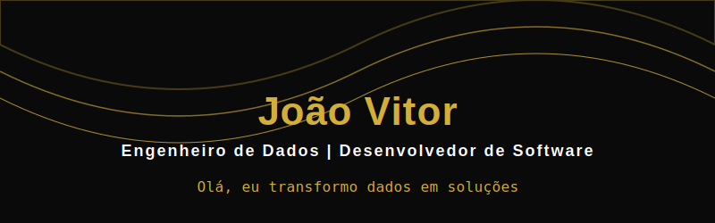

  

  

    

  
  
  

    

  

 

 

<table border="0" style="width: 100%;">
  <tr>
    <td width="48%" valign="top">
      
### 👨‍💻 Sobre Mim

> *"Automatizando processos e transformando dados brutos em estratégias acionáveis."*

Sou estudante de Ciência da Computação, **Fundador da QuadCode** e atuo como Engenheiro e Analista de Dados. Especialista na criação de soluções escaláveis, desde a arquitetura de dados (ETL, Scraping) até o desenvolvimento de plataformas completas em SaaS.

- 🎓 **Formação:** Ciência da Computação @ Estácio (Previsão: 2027)
- 🚀 **Foco Atual:** Engenharia de Dados, Integração com IA e Automações complexas de negócio.
- 💼 **Experiência:** Liderança de Equipe de Devs na QuadCode, entregando projetos reais como Telemonitoramento Clínico, BI para construção civil e Analytics Esportivo.
- 💡 **Diferencial:** Uno conhecimento profundo em código nativo com prototipagem acelerada por IA.

</td>
<td width="4%" valign="top"></td> <td width="48%" valign="top">

### 🛠️ Tech Stack & Skills

**Linguagens Principais** 

**Banco de Dados & Engenharia**   

**Automação, Cloud & IA** 

**Ferramentas Front-end & Versionamento** 

</td>
  </tr>
</table>

 

### 🏆 Projetos em Destaque

<table border="0" style="width: 100%;">
  <tr>
    <td width="50%" valign="top">
      <h4>🩺 BioTrack SaaS</h4>
      
Plataforma de telemonitoramento clínico com integração de Inteligência Artificial para análise preditiva e automação de coleta via API do WhatsApp.

      
    </td>
    <td width="50%" valign="top">
      <h4>✨ Patrícia Neri - Landing Page</h4>
      
Desenvolvimento de página de alta conversão. Foco em performance web, design responsivo moderno e arquitetura limpa de front-end.

      
    </td>
  </tr>
  <tr>
    <td width="50%" valign="top">
      <h4>🏗️ Dashboard BI (INSS de Obras)</h4>
      
Desenvolvimento de automação e Business Intelligence focados em métricas de redução de impostos para o setor de construção civil.

      
    </td>
    <td width="50%" valign="top">
      <h4>⚽ FutScore Analytics & Scout</h4>
      
Pipeline de dados esportivos focado no Brasileirão, realizando coleta automatizada (Scrapy) e análise avançada de desempenho.

      
    </td>
  </tr>
</table>

 

  
  

 

